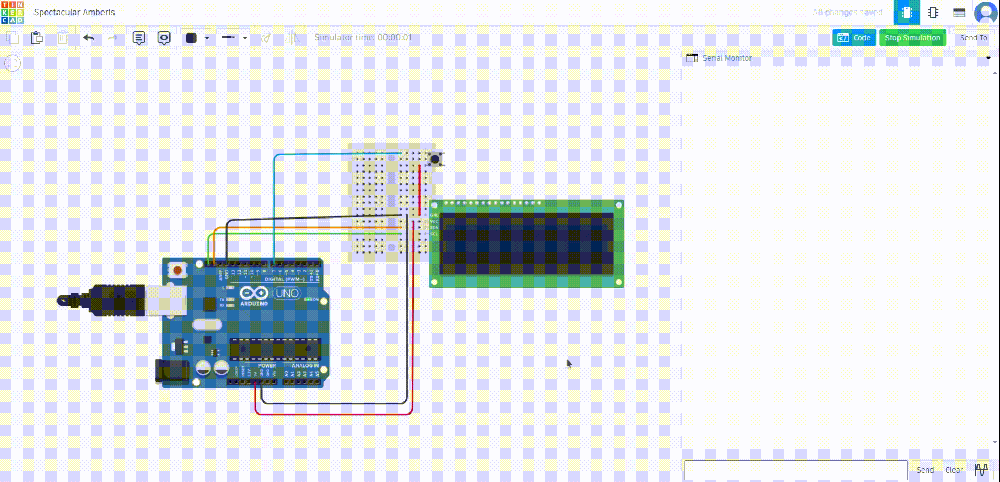

# Arduino Button and LCD (I2C) Display Interaction

## Aim
To detect button presses using a push button and display a message ("TOUCHED") on an LCD (I2C interface) whenever the button is pressed.

---

## Components Required
- Arduino board (e.g., Arduino Uno)
- 16x2 LCD with I2C interface
- Push button
- Resistors (if required)
- Jumper wires
- Breadboard

---

## Circuit Diagram
### Connections:
1. **LCD (I2C Interface)**:
   - **VCC**: Connect to Arduino **5V**.
   - **GND**: Connect to Arduino **GND**.
   - **SDA**: Connect to Arduino **A4** (Uno).
   - **SCL**: Connect to Arduino **A5** (Uno).

2. **Push Button**:
   - One terminal: Connect to Arduino **pin 7**.
   - Other terminal: Connect to **GND**.
   - Enable internal pull-up by configuring pin 7 as `INPUT_PULLUP`.

---

## Video Simulation




---
## Program
### Code
```cpp
#include <LiquidCrystal_I2C.h>

LiquidCrystal_I2C lcd(0x3F, 16, 2); // Initialize the LCD with I2C address 0x3F, 16 columns, 2 rows

const int BUTTON_PIN = 7; // Pin connected to the push button
int lastState = LOW; // Stores the last state of the button
int currentState;

void setup() {
  Serial.begin(9600); // Initialize serial communication for debugging
  pinMode(BUTTON_PIN, INPUT_PULLUP); // Set the button pin as input with an internal pull-up resistor
  lcd.init(); // Initialize the LCD
  lcd.backlight(); // Turn on the LCD backlight
}

void loop() {
  currentState = digitalRead(BUTTON_PIN); // Read the current state of the button

  // Check if the button is pressed (transition from not pressed to pressed)
  if (lastState == HIGH && currentState == LOW) { 
    Serial.println("Button pressed");
    lcd.clear(); // Clear the LCD display
    lcd.setCursor(0, 0); // Set the cursor to the first row, first column
    lcd.print("TOUCHED"); // Display "TOUCHED" on the LCD
    delay(500); // Keep the message for 500ms
    lcd.clear(); // Clear the LCD display
  }

  lastState = currentState; // Update the last state
}
```

---

## How It Works
1. **Button Detection**:
   - The push button is connected to pin 7 with an internal pull-up resistor enabled (`INPUT_PULLUP`).
   - When the button is pressed, the state changes from `HIGH` to `LOW`, and this transition is detected in the code.

2. **LCD Interaction**:
   - The LCD (16x2) is initialized using the I2C library with address `0x3F`.
   - Upon button press, the message "TOUCHED" is displayed briefly before clearing the screen.

3. **Serial Monitoring**:
   - Each button press is logged in the Serial Monitor with the message "Button pressed" for debugging purposes.

---

## Steps to Execute
1. **Setup the Circuit**:
   - Connect the components as described in the Circuit Diagram section.

2. **Upload the Code**:
   - Open the Arduino IDE.
   - Copy the code into the IDE.
   - Upload the code to the Arduino board.

3. **Test the Setup**:
   - Power the Arduino board.
   - Press the push button and observe the LCD displaying "TOUCHED" briefly.
   - Open the Serial Monitor at a baud rate of **9600** to see the button press messages.

---

## How It Works
1. When the button is pressed, it triggers a state change from `HIGH` to `LOW`.
2. This triggers a message "TOUCHED" to be displayed on the LCD.
3. The message is shown for 500ms and then cleared to be ready for the next button press.

---

## Troubleshooting
1. **No Response on Button Press**:
   - Verify the button connections.
   - Ensure the correct pin number is defined for the button (`BUTTON_PIN`).
   - Check the internal pull-up resistor setting (`INPUT_PULLUP`).

2. **No Display on LCD**:
   - Confirm the I2C address of the LCD (`0x3F` in this case).
   - Ensure proper connections to SDA and SCL pins.

3. **Serial Monitor Not Showing Output**:
   - Verify the baud rate of the Serial Monitor matches the code (`9600`).
   - Check the USB connection between the Arduino and your computer.

---

## Additional Notes
- If your LCD I2C address is different, scan for the correct address using an I2C scanner sketch.
- Adjust the delay times as needed for better user experience.

---
