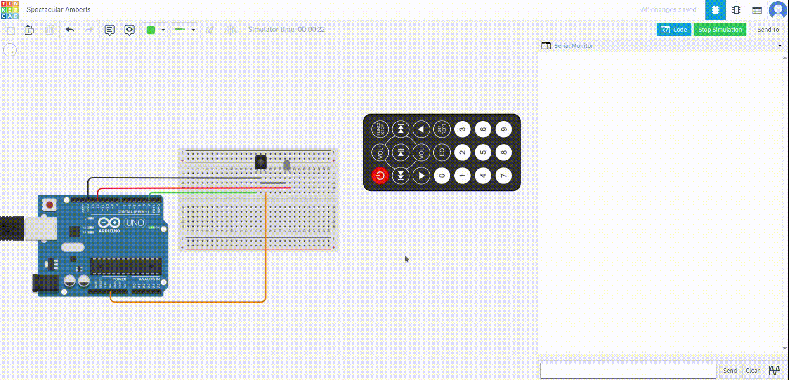

# Interfacing Arduino with IR Sensor

## Aim
To detect obstacles using an IR sensor and indicate detection by turning on an LED, with real-time status printed on the Serial Monitor.

---

## Components Required
- Arduino board (e.g., Arduino Uno)
- IR sensor module
- LED
- 220Ω resistor (for the LED)
- Breadboard
- Jumper wires

---

## Video Simulation




---

## Circuit Diagram
1. **IR Sensor**:
   - **VCC**: Connect to Arduino **5V**.
   - **GND**: Connect to Arduino **GND**.
   - **OUT**: Connect to Arduino digital pin **2**.

2. **LED**:
   - **Positive (Anode)**: Connect to Arduino digital pin **12** via a 220Ω resistor.
   - **Negative (Cathode)**: Connect to Arduino **GND**.

---

## Program
### Code
```cpp
// Define pin connections
const int irSensorPin = 2;   // Pin connected to the IR sensor
const int ledPin = 12;       // Pin connected to the LED

void setup() {
  // Initialize the IR sensor pin as input
  pinMode(irSensorPin, INPUT);

  // Initialize the LED pin as output
  pinMode(ledPin, OUTPUT);
  
  Serial.begin(9600);

  // Ensure the LED is off at the start
  digitalWrite(ledPin, LOW);
}

void loop() {
  // Read the IR sensor value
  int irValue = digitalRead(irSensorPin);

  // Check if an obstacle is detected (usually HIGH for detection)
  if (irValue == LOW) {
    // Turn on the LED
    digitalWrite(ledPin, HIGH);
    Serial.println("Obstacle Detected !!!");

    // Wait for 500 milliseconds
    delay(500);

    // Turn off the LED
    digitalWrite(ledPin, LOW);
  }

  // Small delay to avoid rapid toggling
  delay(100);
}
```

---

## Steps to Execute
1. **Set Up the Circuit**:
   - Connect the IR sensor and LED as per the Circuit Diagram.

2. **Upload the Code**:
   - Open the Arduino IDE.
   - Copy the code into the IDE.
   - Upload the code to the Arduino board.

3. **Test the Setup**:
   - Open the Serial Monitor at a baud rate of **9600**.
   - Move an object in front of the IR sensor:
     - The LED lights up when an obstacle is detected.
     - The Serial Monitor displays "Obstacle Detected !!!".

---

## Notes
- Ensure the IR sensor is positioned correctly for detection.
- Adjust the IR sensor's sensitivity (if possible) for optimal performance.
- The IR sensor typically outputs `LOW` when an obstacle is detected and `HIGH` otherwise (verify with your specific sensor).

---

## Troubleshooting
1. **LED Does Not Light Up**:
   - Check connections for the LED and resistor.
   - Ensure the IR sensor is correctly connected and powered.

2. **No Serial Output**:
   - Verify the correct baud rate (`9600`) in the Serial Monitor.
   - Ensure the IR sensor and LED pins match those defined in the code.

---
