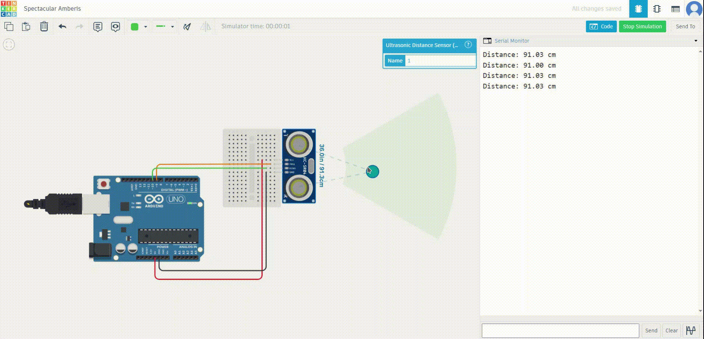

# Interfacing Arduino with Ultrasonic Sensor

## Aim
To measure the distance of an object using an ultrasonic sensor and display the results on the Serial Monitor.

---

## Components Required
- Arduino board (e.g., Arduino Uno)
- Ultrasonic sensor module (e.g., HC-SR04)
- Breadboard
- Jumper wires

---

## Circuit Diagram
1. **Ultrasonic Sensor**:
   - **VCC**: Connect to Arduino **5V**.
   - **GND**: Connect to Arduino **GND**.
   - **Trig**: Connect to Arduino digital pin **9**.
   - **Echo**: Connect to Arduino digital pin **10**.

---

## Video Simulation




---

## Program
### Code
```cpp
// Define pin connections for the ultrasonic sensor
const int trigPin = 9;  // Pin connected to the Trig pin of the sensor
const int echoPin = 10; // Pin connected to the Echo pin of the sensor

// Variable to store the calculated distance
long duration;
float distance;

void setup() {
  // Initialize the serial communication for debugging
  Serial.begin(9600);

  // Set the trigPin as an output and echoPin as an input
  pinMode(trigPin, OUTPUT);
  pinMode(echoPin, INPUT);
}

void loop() {
  // Clear the trigPin
  digitalWrite(trigPin, LOW);
  delayMicroseconds(2);

  // Send a 10-microsecond pulse to the trigPin
  digitalWrite(trigPin, HIGH);
  delayMicroseconds(10);
  digitalWrite(trigPin, LOW);

  // Read the echoPin and calculate the duration (time for the sound wave to return)
  duration = pulseIn(echoPin, HIGH);

  // Calculate the distance in cm
  // Speed of sound in air is approximately 343 m/s (or 34300 cm/s)
  // Divide by 2 as the wave travels to the object and back
  distance = (duration * 0.0343) / 2;

  // Print the distance to the Serial Monitor
  Serial.print("Distance: ");
  Serial.print(distance);
  Serial.println(" cm");

  // Wait for a short period before the next measurement
  delay(500);
}
```

---

## How It Works
1. **Ultrasonic Sensor Principle**:
   - The ultrasonic sensor emits a high-frequency sound pulse using the **Trig** pin.
   - The sound wave travels through the air and bounces back when it hits an object.
   - The sensor receives the reflected wave through the **Echo** pin.

2. **Distance Calculation**:
   - The time taken for the wave to travel to the object and back is measured using the `pulseIn` function.
   - The formula for calculating the distance is:
     \[
     \text{Distance (cm)} = \frac{\text{Duration} \times 0.0343}{2}
     \]
     Where:
     - **0.0343 cm/µs** is the speed of sound in air.
     - The result is divided by 2 because the wave travels to the object and back.

3. **Arduino Code**:
   - The code repeatedly sends a trigger pulse and measures the time for the echo pulse.
   - The calculated distance is displayed on the Serial Monitor.

---

## Steps to Execute
1. **Setup the Circuit**:
   - Connect the ultrasonic sensor to the Arduino as described in the Circuit Diagram.

2. **Upload the Code**:
   - Open the Arduino IDE.
   - Copy the code into the IDE.
   - Upload the code to the Arduino board.

3. **Test the Setup**:
   - Open the Serial Monitor at a baud rate of **9600**.
   - Place an object in front of the ultrasonic sensor.
   - Observe the distance values displayed on the Serial Monitor.

---

## Troubleshooting
1. **Incorrect or No Distance Values**:
   - Ensure the sensor connections (Trig, Echo, VCC, GND) are correct.
   - Verify that the object is within the sensor's range (typically 2 cm to 400 cm for HC-SR04).
   - Avoid placing the sensor in noisy or highly reflective environments.

2. **No Output on Serial Monitor**:
   - Ensure the Serial Monitor baud rate matches the code (`9600`).
   - Check the USB connection between the Arduino and your computer.

---