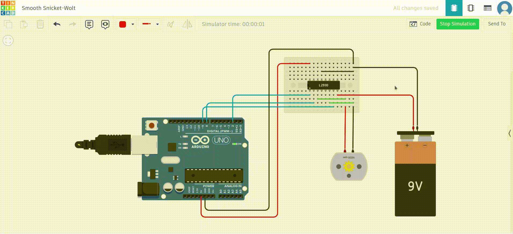

### **Experiment No: 3**  
#### **Interfacing DC Motors with Arduino - Speed and Direction Control**  

---

### **Aim**  
To write a program to generate PWM pulses for speed control of a DC motor.

---

### **Objective**  
To control the speed and direction of rotation of a DC motor using an Arduino UNO board.

---

### **Components Required**  
1. **Arduino UNO** – 1 unit  
2. **DC Motor** – 1 unit  
3. **L298 or L293D Motor Driver IC (H-Bridge)** – 1 unit  
4. **Potentiometer (optional for speed adjustment)** – 1 unit  
5. **Tactile Push Button (optional for direction control)** – 1 unit  
6. **Connecting Wires**  
7. **Breadboard** – 1 unit  
8. **External Power Supply (if required for motor)** – 1 unit  
9. **Resistors** (as needed for button and potentiometer connections)  

---
## Video Simulation




---

### **Overview of DC Motor**  
- **Working Principle**: Converts electrical energy (Direct Current) into mechanical energy in the form of rotational motion.
- **Components**:  
  1. **Stator**: Permanent magnets and brushes.  
  2. **Rotor (Armature)**: Output shaft, windings, and commutator.  
  3. **Mechanism**: Rotor rotates when magnetic poles from the stator attract/repel the rotor poles.

---

### **Controlling Motor Speed**  
The **speed** of a DC motor can be controlled by:
1. Varying the **supply voltage**.
2. Adjusting the **flux** through the windings.
3. Changing the **armature voltage** or resistance.

#### **Pulse Width Modulation (PWM)**  
- PWM regulates the average voltage applied to the motor by switching it ON and OFF at high speeds.
- The **duty cycle** determines the average voltage:  
  - **100% Duty Cycle**: Full voltage applied.  
  - **50% Duty Cycle**: Half voltage applied.

---

### **H-Bridge for Direction Control**  
- **L298 Motor Driver IC** used to implement the H-Bridge circuit.  
- It consists of:
  - Four electronic switches (BJTs or MOSFETs).  
  - Four freewheeling diodes (to prevent short circuits).  
- Allows control of motor **direction** by altering the current flow.

---

### **Connections**
1. **L298 Driver**:
   - `IN_1` and `IN_2`: Logic pins to control direction.
   - `PWM`: For speed control via duty cycle.
2. **DC Motor**:
   - Connect motor terminals to the output pins of the L298 driver.
3. **Arduino**:
   - Digital pins 2, 8, and 9 control PWM and logic pins.

---

### **Arduino Functions**  
1. **`analogWrite(pin, value)`**:  
   - Generates PWM signals on specific pins.  
   - `value`: 0 (0% duty cycle) to 255 (100% duty cycle).  

2. **`digitalPinToInterrupt(pin)` and `attachInterrupt(...)`**:  
   - Used for handling interrupts on pins 2 or 3 (for event-triggered control).  

---

### **Code Explanation**

#### **Program to Control Speed and Direction of DC Motor**
```cpp
const int pwm = 2;    // PWM pin for speed control
const int in_1 = 8;   // Logic pin 1 for direction control
const int in_2 = 9;   // Logic pin 2 for direction control

void setup() {
  pinMode(pwm, OUTPUT);  // Set PWM pin as output
  pinMode(in_1, OUTPUT); // Set direction pin 1 as output
  pinMode(in_2, OUTPUT); // Set direction pin 2 as output
}

void loop() {
  // Clockwise Rotation: in_1 = HIGH, in_2 = LOW
  digitalWrite(in_1, HIGH);
  digitalWrite(in_2, LOW);
  analogWrite(pwm, 255); // Maximum speed
  delay(3000);           // Rotate clockwise for 3 seconds

  // Brake: in_1 = HIGH, in_2 = HIGH
  digitalWrite(in_1, HIGH);
  digitalWrite(in_2, HIGH);
  delay(1000);           // Stop motor for 1 second

  // Counterclockwise Rotation: in_1 = LOW, in_2 = HIGH
  digitalWrite(in_1, LOW);
  digitalWrite(in_2, HIGH);
  analogWrite(pwm, 255); // Maximum speed
  delay(3000);           // Rotate counterclockwise for 3 seconds

  // Brake: in_1 = HIGH, in_2 = HIGH
  digitalWrite(in_1, HIGH);
  digitalWrite(in_2, HIGH);
  delay(1000);           // Stop motor for 1 second
}
```

---

### **Working Explanation**
1. **Speed Control**:  
   The `analogWrite()` function generates a PWM signal to control motor speed. The value (0-255) adjusts the duty cycle.

2. **Direction Control**:  
   - `in_1 = HIGH` and `in_2 = LOW`: Clockwise rotation.  
   - `in_1 = LOW` and `in_2 = HIGH`: Counterclockwise rotation.

3. **Brake**:  
   Both `in_1` and `in_2` are set to HIGH, stopping the motor.

---

### **Circuit Diagram**  
The diagram includes:  
1. Arduino UNO connections with the L298 motor driver IC.  
2. Motor connections to the output pins of L298.  
3. External power supply to the motor if required.

---

### **Key Observations**  
- Duty cycle changes result in different motor speeds.  
- Logic pin configurations effectively control direction.

---

### **Conclusion**  
This experiment successfully demonstrates the interfacing of a DC motor with Arduino for speed and direction control using PWM and an H-Bridge.