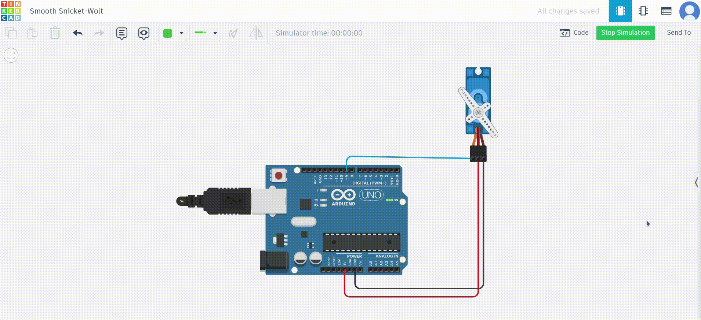
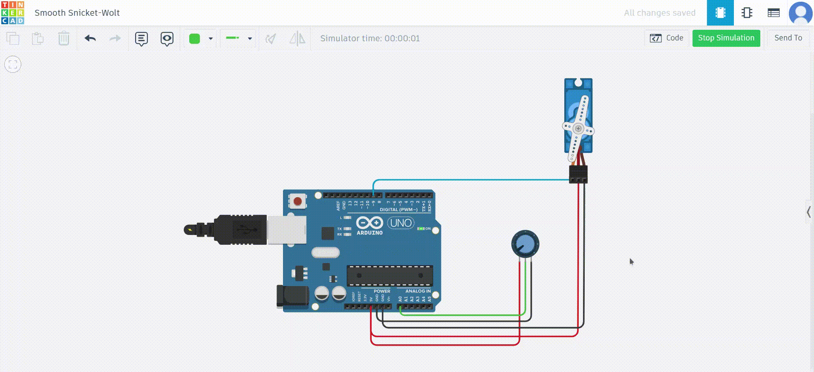

Speed Control of a DC Servo Motor Using Arduino UNO

---

## Aim
To write a program to control the speed of a DC servo motor using an Arduino UNO board.

---

## Objective
To interface a DC servo motor with an Arduino UNO board and control its motion using a potentiometer for manual position adjustments and an automated sweep using PWM signals.

---

## Theory
A servo motor is a closed-loop system that precisely controls the position of its shaft using position feedback. It typically consists of:
- **DC Motor**: High-speed, low-torque motor.
- **Gearbox**: Reduces speed and increases torque.
- **Potentiometer**: Provides feedback on the output shaft's position.
- **Control Circuit**: Compares the feedback voltage with the target position and adjusts the motor’s direction accordingly using an H-Bridge.

A servo motor operates on PWM signals, where:
- A pulse of **1 ms** rotates the motor to 0 degrees.
- A pulse of **1.5 ms** rotates the motor to 90 degrees.
- A pulse of **2 ms** rotates the motor to 180 degrees.
The pulse signal is repeated every 20 milliseconds (50 Hz).

---

## Components Required
- Arduino Uno Rev3
- Breadboard
- Breadboard jumper wires
- 10K potentiometer (trim pot)
- SG90 Servo Motor

---


## Technical Specifications of SG90 Servo Motor
- Operating Voltage: 4.8–6VDC (5V typical)
- Maximum Rotation Angle: 180 degrees (±90 degrees from the center)
- Idle Current: ~10 mA
- Moving Current: 100–250 mA

---

## Wiring Diagram
### 1. **Servo Motor to Arduino UNO**
| Servo Motor Pin | Arduino Pin |
|------------------|-------------|
| Red (Vcc)        | 5V          |
| Brown/Black (GND)| GND         |
| Orange/Yellow    | PWM Pin 9   |

### 2. **Servo Motor with Potentiometer**
| Potentiometer Pin | Arduino Pin |
|--------------------|-------------|
| Vcc                | 5V          |
| GND                | GND         |
| Signal (wiper)     | Analog Pin A0 |

---

## Procedure
### **1. Controlling Servo with Predefined Sweep**
Use the Arduino IDE's built-in "Sweep" example to make the servo sweep automatically from 0 to 180 degrees and back.

#### Arduino Code:
```cpp
#include <Servo.h>

int servoPin = 9; // Servo control pin
Servo servo; // Create a servo object
int angle = 0; // Servo position in degrees

void setup() {
  servo.attach(servoPin); // Attach the servo to pin 9
}

void loop() {
  // Sweep from 0 to 180 degrees
  for (angle = 0; angle <= 180; angle++) {
    servo.write(angle); // Set servo to current angle
    delay(15); // Wait for servo to reach position
  }

  // Sweep back from 180 to 0 degrees
  for (angle = 180; angle >= 0; angle--) {
    servo.write(angle); // Set servo to current angle
    delay(15); // Wait for servo to reach position
  }
}
```
---
## Video Simulation




---

### **2. Controlling Servo with Potentiometer**
Manually adjust the servo position using a potentiometer to vary the PWM signal.

#### Arduino Code:
```cpp
#include <Servo.h>

int potPin = A0; // Potentiometer connected to Analog pin A0
int servoPin = 9; // Servo control pin
Servo servo; // Create a servo object

void setup() {
  servo.attach(servoPin); // Attach the servo to pin 9
}

void loop() {
  int reading = analogRead(potPin); // Read potentiometer value (0 to 1023)
  int angle = map(reading, 0, 1023, 0, 180); // Map to servo angle (0 to 180 degrees)
  servo.write(angle); // Set servo to calculated angle
  delay(15); // Wait for servo to reach position
}
```
---
## Video Simulation




---

## Results
1. **Sweep Example**: The servo motor continuously rotates from 0 to 180 degrees and back automatically.
2. **Potentiometer Example**: The servo motor's position is manually adjusted using the potentiometer.

---

## Observations
1. The servo motor operates smoothly within its defined range of motion.
2. The speed and direction of motion vary depending on the PWM signal.

---

## Precautions
1. Ensure proper connections to avoid damaging the servo motor or Arduino board.
2. If the servo motor draws more than 250 mA, use an external power source.
3. Avoid applying excessive torque or force on the servo motor shaft.

---

## Conclusion
The SG90 servo motor was successfully interfaced with the Arduino UNO board. The motor's speed and position were controlled using both predefined code and manual potentiometer input.