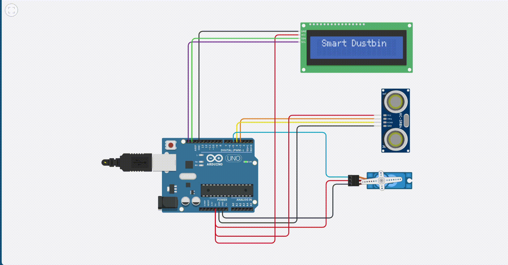

# Auto Lid Opener for Smart Dustbin

## **Objective**
To build a smart dustbin system that automatically opens its lid when an object (such as a hand) is detected within a certain distance using an ultrasonic sensor and a servo motor.

---

## **Requirements**

- **Hardware:**
  - Arduino Uno
  - Ultrasonic Sensor (HC-SR04)
  - Servo Motor
  - I2C LCD Display (16x2)
  - Jumper wires
  - Breadboard
  - Power supply (USB or battery)

- **Software:**
  - Arduino IDE
  - Required libraries:
    - Servo.h
    - LiquidCrystal_I2C.h

- **Knowledge:**
  - Basics of Arduino programming
  - Understanding of ultrasonic sensors and servo motors
  - Interfacing LCD via I2C

---

## **Theory**
This system uses an ultrasonic sensor to detect objects (such as a user’s hand) within a predefined distance (30 cm). If detected, a servo motor opens the dustbin lid automatically. An I2C LCD provides real-time feedback to the user, indicating when the lid is opening or closing. The servo motor is controlled by PWM signals from the Arduino.

---

## **Procedure**

1. Connect the **HC-SR04 ultrasonic sensor**:
   - VCC to 5V
   - GND to GND
   - TRIG to digital pin 3
   - ECHO to digital pin 4

2. Connect the **Servo motor**:
   - Signal to digital pin 5
   - VCC to 5V
   - GND to GND

3. Connect the **I2C LCD display**:
   - SDA to A4
   - SCL to A5
   - VCC to 5V
   - GND to GND

4. Open Arduino IDE, paste the code below, and upload it to the Arduino Uno.

---
## Video Simulation




---

## **Code**
```cpp
// Auto Lid Opener for Smart Dustbin

#include <Servo.h>
#include <LiquidCrystal_I2C.h>

// Pin definitions
#define TRIG_PIN 3
#define ECHO_PIN 4
#define SERVO_PIN 5

// Distance threshold for opening lid (in cm)
#define DISTANCE_THRESHOLD 30

// Servo angles
#define LID_OPEN_ANGLE 90
#define LID_CLOSE_ANGLE 0

LiquidCrystal_I2C lcd(0x27, 16, 2);
Servo servo;

// State to track lid position
bool lidOpen = false;

void setup() {
    pinMode(TRIG_PIN, OUTPUT);
    pinMode(ECHO_PIN, INPUT);

    servo.attach(SERVO_PIN);
    servo.write(LID_CLOSE_ANGLE);

    lcd.init();
    lcd.backlight();
    lcd.setCursor(1, 0);
    lcd.print("Smart Dustbin");
    delay(2000);
    lcd.clear();
}

long getDistance() {
    digitalWrite(TRIG_PIN, LOW);
    delayMicroseconds(2);
    digitalWrite(TRIG_PIN, HIGH);
    delayMicroseconds(10);
    digitalWrite(TRIG_PIN, LOW);
    
    long duration = pulseIn(ECHO_PIN, HIGH, 20000); // Timeout after 20ms
    long distance = duration * 0.034 / 2;

    return (distance == 0 || distance > 200) ? 200 : distance; // Cap to avoid noise
}

void loop() {
    long distance = getDistance();

    if (distance < DISTANCE_THRESHOLD && !lidOpen) {
        lcd.clear();
        lcd.setCursor(0, 0);
        lcd.print("Object Detected!");
        lcd.setCursor(0, 1);
        lcd.print("Opening Lid...");
        servo.write(LID_OPEN_ANGLE);
        lidOpen = true;
        delay(3000); // Keep lid open for 3 seconds
    } 
    else if (distance >= DISTANCE_THRESHOLD && lidOpen) {
        lcd.clear();
        lcd.setCursor(0, 0);
        lcd.print("No Object Nearby");
        lcd.setCursor(0, 1);
        lcd.print("Closing Lid...");
        servo.write(LID_CLOSE_ANGLE);
        lidOpen = false;
    }

    delay(300); // Loop delay to prevent jitter
}
```

---

## **Expected Output**
- When an object is placed within **30 cm**, the LCD displays *"Object Detected! Opening Lid..."* and the lid opens via the servo.
- After 3 seconds or when the object is no longer near, the LCD updates to *"No Object Nearby Closing Lid..."* and the lid closes.

---

## **Conclusion**
This experiment demonstrates how a basic smart system can be built using Arduino to automate real-world tasks. The dustbin lid opens automatically when motion is detected, reducing the need for physical contact and promoting hygiene.

---

## **Additional Notes**
- Ensure your servo motor has sufficient torque and is powered adequately.
- You can adjust the **`DISTANCE_THRESHOLD`** and **servo angles** as per your dustbin’s design.
- Use an external power source if your servo draws more current than USB can supply.
- Consider adding a delay between reads to prevent erratic behavior.

