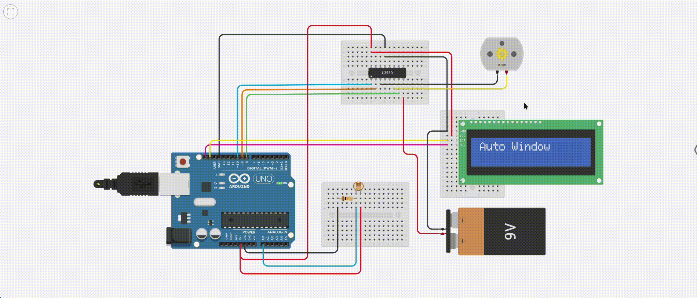

# Auto Window Opener Using Light Sensor

## **Objective**
To design and implement an automated window system that opens or closes based on ambient light levels using an LDR sensor, motor driver, and an LCD display.

---

## **Requirements**

- **Hardware:**
  - Arduino Uno
  - LDR (Light Dependent Resistor)
  - DC Motor or Motor Driver (L298N or similar)
  - LCD Display (16x2) with I2C module
  - Transistor or motor driver module
  - Resistors for LDR voltage divider
  - Jumper wires
  - Breadboard
  - External power supply (if motor draws high current)

- **Software:**
  - Arduino IDE
  - Required libraries:
    - Wire.h
    - LiquidCrystal_I2C.h

- **Knowledge:**
  - Analog sensor readings
  - Controlling DC motors
  - Using LCD with I2C

---

## **Theory**
An LDR (Light Dependent Resistor) varies its resistance based on light intensity. When light falls below a defined threshold, it indicates low light conditions (evening or cloudy weather), prompting the system to open the window. If it becomes brighter than the threshold, the window closes. A motor is used to control the window movement, and an I2C LCD displays system status and light level.

---

## **Procedure**

1. **Circuit Connections:**
   - **LDR**: Connect one end to 5V and the other to A0 through a 10kΩ resistor to GND (voltage divider).
   - **Motor Driver Pins**:
     - IN1 to digital pin 8
     - IN2 to digital pin 9
     - EN (enable/speed control) to pin 10 (PWM)
   - **LCD Display**:
     - SDA to A4
     - SCL to A5
     - VCC to 5V
     - GND to GND

2. Connect the motor terminals to the motor driver output terminals.

3. Upload the code to your Arduino Uno using the Arduino IDE.

---
## Video Simulation




---


## **Code**
```cpp
#include <Wire.h>
#include <LiquidCrystal_I2C.h>

#define LDR_PIN A0
#define MOTOR_IN1 8
#define MOTOR_IN2 9
#define MOTOR_EN 10

#define LIGHT_THRESHOLD 300  // Lower value means less light

LiquidCrystal_I2C lcd(0x27, 16, 2);

// Track motor/window state
bool windowOpen = false;

void setup() {
  // Motor pins
  pinMode(MOTOR_IN1, OUTPUT);
  pinMode(MOTOR_IN2, OUTPUT);
  pinMode(MOTOR_EN, OUTPUT);
  
  // LCD
  lcd.init();
  lcd.backlight();
  lcd.setCursor(0, 0);
  lcd.print("Auto Window");

  delay(1500);
  lcd.clear();
}

void openWindow() {
  digitalWrite(MOTOR_IN1, HIGH);
  digitalWrite(MOTOR_IN2, LOW);
  analogWrite(MOTOR_EN, 200); // Adjust speed if needed
  lcd.setCursor(0, 0);
  lcd.print("Low Light: Open");
  delay(3000); // Run motor for 3 sec (adjust for your window)
  stopMotor();
  windowOpen = true;
}

void closeWindow() {
  digitalWrite(MOTOR_IN1, LOW);
  digitalWrite(MOTOR_IN2, HIGH);
  analogWrite(MOTOR_EN, 200); 
  lcd.setCursor(0, 0);
  lcd.print("Bright: Close    ");
  delay(3000); // Run motor for 3 sec
  stopMotor();
  windowOpen = false;
}

void stopMotor() {
  digitalWrite(MOTOR_IN1, LOW);
  digitalWrite(MOTOR_IN2, LOW);
  analogWrite(MOTOR_EN, 0);
}

void loop() {
  int lightValue = analogRead(LDR_PIN);

  lcd.setCursor(0, 1);
  lcd.print("Light: ");
  lcd.print(lightValue);
  lcd.print("   ");

  if (lightValue < LIGHT_THRESHOLD && !windowOpen) {
    openWindow();
  } else if (lightValue >= LIGHT_THRESHOLD && windowOpen) {
    closeWindow();
  }

  delay(1000);
}
```

---

## **Expected Output**
- When the ambient light falls below the set threshold, the window opens, and the LCD shows *"Low Light: Open"*.
- When the light increases, the window closes, and the LCD updates to *"Bright: Close"*.
- The current light intensity is continuously displayed on the second line of the LCD.

---

## **Conclusion**
This project successfully demonstrates how light intensity can be used to control a physical system, such as a window, enhancing home automation. It uses basic sensor inputs to make logical decisions and actuate motor movement accordingly.

---

## **Additional Notes**
- The light threshold can be fine-tuned depending on your room’s lighting conditions.
- Use a motor with proper torque for your window weight.
- To improve, you could:
  - Add limit switches to detect fully open/closed states.
  - Include manual override buttons.
  - Use a stepper motor or servo for more precise control.
